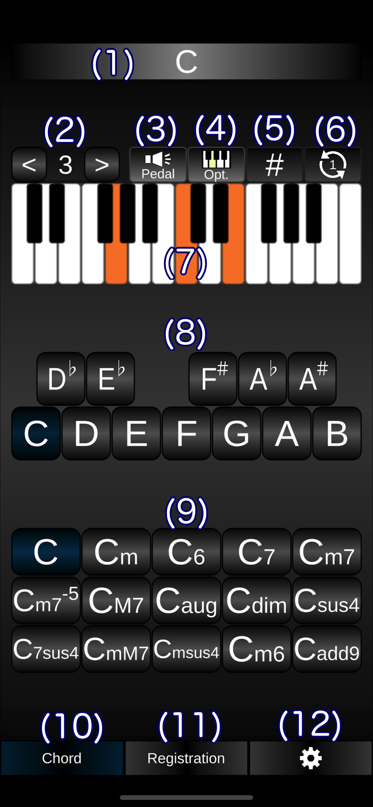

# How to use the 'iEleChords' app.

## The first step to use this app.

- Pressed the (8) button to select the root note.
- Pressed the (9) button to select the chord.

## The description of the buttons.

(1) Show the selected chord name.

(2) Shift the octave up or down.

(3) The toggle button for to play or not the root note. 

(4) The toggle button for to show and play or not the option keyboard.

(5) The toggle button to show the code name with the sharp or flat.

(6) Switch the pattern of which press the keyboards of the notes contains in the chord.

(7) The keyboard for the to show the pattern of which press the keyboards of the notes contains in the chord.

(8) The button for the selecting root note.

(9) The button for the selecting chord.

(10) Switch to this page.

(11) Switch to the selecting Registration Memory buttons page.

(12) Switch to the settings page.

## How to connect to the Electone.

- Your iPhone could connecting to the Electone via USB and USB connector.
- Use the [USB TO DEVICE] terminal installed on the Electone.