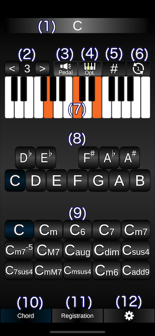
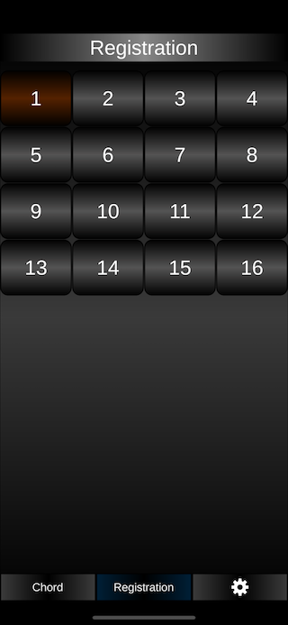

# How to use the 'iEleChords' app.

## Getting Started

- Pressed the button (8) to select the root note.
- Pressed the button (9) to select the chord.

## Operation buttons

(1) Show the selected chord name.

(2) Shift the octave up or down.

(3) The toggle button for to play or not the root note. 

(4) The toggle button for to show and play or not the option keyboard.

(5) The toggle button to show the code name with the sharp or flat.

(6) Switch the pattern of which press the keyboards of the notes contains in the chord.

(7) The keyboard for the to show the pattern of which press the keyboards of the notes contains in the chord.

(8) The button for the selecting root note.

(9) The button for the selecting chord.

(10) Switch to this page.

(11) Switch to the Registration Memory buttons page.

(12) Switch to the settings page.

## How to connect to the Electone

- Your iPhone could connecting to the Electone via USB and USB connector.
- Use the [USB TO DEVICE] terminal installed on the Electone.
- Goto Settings page in this app. Choice the Electone from 'MIDI IN Device' and 'MIDI OUT Device'.

## Registration Memory buttons page

・Press the button on this page to swith the Registration Memory on the Electone.

・If you press the registration memory button on the  Electone, it will be reflected in the registration memory button on this page.

## Settings page

## Operation buttons

(1) Enable the midi input (from the Electone). 

(2) Enable the midi output (to the Elctone). 

(3) Enable the internal soft synth.

(4) Select the midi input device. (Select the Electone device.)

(5) Select the midi output device.(Select the Electone device.)

(6) Refresh the midi input and output device list.

(7) Reset the midi device.

(8) Switch the midi output to the upper keyboard channel. 

(9) Switch the midi output to the lower keyboard channel. 

(10) Enable the midi output to the pedal keyboard channel for the root note. 

(11) Set the midi velocity for the midi output channel.

(12) Choice the instrument for the internal soft synth.