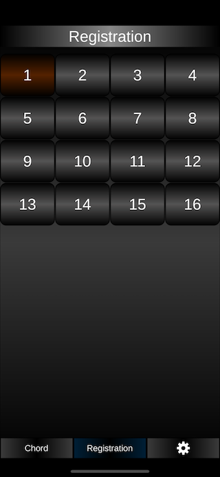
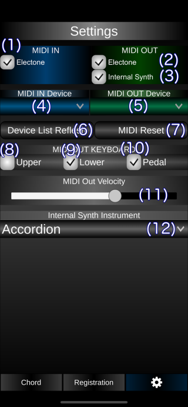

# 使い方

## 簡単な使い方

- (8)ボタンでルート音を選択します。
- (9)ボタンでコード(和音)を選択します。

## 操作ボタン

(1) コード名を表示します。

(2) キーボードのオクターブを上げ下げます。

(3) コードを鳴らすときにルート音も鳴らすかどうかを設定します。

(4) コードに押さなくてもいい黄色で示されるキーボードがある場合に表示するかどうかを設定します。

(5) コードをシャープまたはフラットで表示します。

(6) コードの押さえるキーボードのバリエーションを切り替えます。

(7) コードの押さえるキーボードを表示します。またキーボードをタップすると音が鳴ります。エレクトーンと接続している場合は、エレクトーンで押さえたキーボードが表示されます。

(8) ルート音を選択します。

(9) コードを選択します。

(10) コードを表示するこのページに切り替えます。

(11) レジストレーションメモリーボタンページに切り替えます。

(12) 設定画面に切り替えます。

## エレクトーンとの接続の方法

- USB接続キットとUSBケーブルを使用して、iPhoneとエレクトーンを接続します。
- エレクトーンの[USB TO DEVICE] 端子にUSBケーブルを接続してください。
- このアプリの設定画面から、 'MIDI IN Device' と 'MIDI OUT Device'でエレクトーンを選択してください。

## レジストレーションメモリーボタンページ

・数字ボタンを押すとエレクトーンのレジストボタンを押したのと同じ動作を行います。

・逆にエレクトーンのレジストボタンを押すと、この画面で対応するボタンが選択されます。

## 設定画面

## 操作ボタン

(1) MIDI入力の有効/無効を切り替えます。(エレクトーンのから入力になります。) 

(2) MIDI出力の有効/無効を切り替えます。(エレクトーンへの出力になります。)

(3) 内部ソフト音源を鳴らすかどうかの設定です。

(4) MIDI入力デバイスを選択します。 (エレクトーンを選択してください。)

(5) MIDI出力デバイスを選択します。(エレクトーンを選択してください。)

(6) MIDI入出力デバイスを再検索します。

(7) MIDIデバイスのリセットを行います。

(8) 上鍵盤にMIDIデータを出力します。

(9)下鍵盤にMIDIデータを出力します。

(10) ルート音をペダル鍵盤から鳴らすかどうかの設定です。

(11) MIDIのベロシティの設定です。

(12) 内部ソフト音源の楽器を選択します。